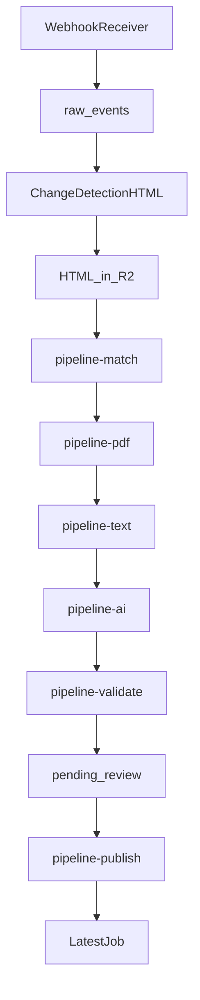

# Rojgaar Suchna Notification Pipeline — Node.js Implementation Plan

## Where We Are Today

The repo already has a **Phase-1 MVP**:

```text
POST /api/webhook/change  →  BullMQ "webhook" queue  →  webhook.service.js (AI on diff)  →  LatestNotification
```

Key files to extend (not rewrite from scratch):

- Webhook entry: `[src/controllers/webhook.controller.js](src/controllers/webhook.controller.js)`, `[src/middleware/verifyWebhook.js](src/middleware/verifyWebhook.js)`
- Queue pattern: `[src/queues/webhook.queue.js](src/queues/webhook.queue.js)`, `[src/workers/webhook.worker.js](src/workers/webhook.worker.js)`
- AI: `[src/service/ai-api/openRouterAPI.js](src/service/ai-api/openRouterAPI.js)`
- R2: `[src/config/r2.js](src/config/r2.js)`, `[src/controllers/uploadController.js](src/controllers/uploadController.js)`
- Publish target: `[src/models/LatestJob.js](src/models/LatestJob.js)`, `[src/controllers/latestJobController.js](src/controllers/latestJobController.js)`

**Target flow** (from the plan doc):




---

## Coding Style Rules (2-year dev, human-friendly)

Keep every chunk simple and readable:

1. **One job = one service function** — e.g. `runMatching(rawEventId)`, not a giant pipeline class
2. **Small utils, not frameworks** — `normalizeTitle()`, `scorePdfCandidate()`, not a "MatchingEngineFactory"
3. **Plain objects in Mongo, big blobs in R2** — queue jobs always `{ raw_event_id }` only
4. **Status updates in one helper** — `updateRawEventStatus(id, status, extra = {})` to avoid copy-paste
5. **Zod for validation** — same pattern as `[src/validators/jobNotificationsValidator.js](src/validators/jobNotificationsValidator.js)`
6. **Log with context** — `console.log('[pipeline-match]', rawEventId, 'matched', score)`
7. **Reuse existing helpers** — `buildSlug`, `generateUniqueSlug`, `normalizeNotificationCategory` from `[src/utils/helper.js](src/utils/helper.js)` and `[src/utils/notificationCategory.js](src/utils/notificationCategory.js)`

---

## New Folder Layout (add gradually, chunk by chunk)

```text
src/
  models/RawEvent.js
  services/
    pipeline/
      rawEvent.service.js       # create, status, idempotency
      changeDetection.service.js # fetch HTML snapshot
      artifactStorage.service.js # R2 put/get helpers
      matching.service.js
      pdfDiscovery.service.js
      pdfDownload.service.js
      pdfExtract.service.js
      qualityGate.service.js
      aiExtract.service.js
      validation.service.js
      publish.service.js
  workers/
    pipeline-match.worker.js
    pipeline-pdf.worker.js
    pipeline-text.worker.js
    pipeline-ai.worker.js
    pipeline-validate.worker.js
    pipeline-publish.worker.js
  queues/
    pipeline-*.queue.js
  validators/
    rawEvent.validator.js
    structuredNotification.validator.js
  constants/
    pipelineStatus.js
```

Run workers from a new entry script later: `src/worker-server.js` (Chunk 8). For now, import workers in `[src/server.js](src/server.js)` like the existing webhook worker.

---

## Chunk 0 — Migration Audit (no behavior change)

**Goal:** Know every `LatestNotification` consumer before we stop writing to it.

**Tasks:**

- Grep repo for `LatestNotification` (already 6 files: controller, service, model, 2 scripts)
- Document: webhook read APIs (`GET /api/webhook/list`, slug, sitemap), any frontend consumers
- Add a short `docs/latest-notification-audit.md` checklist

**Output:** Safe to build new pipeline without breaking reads yet.

---

## Chunk 1 — Foundation: `raw_events` + Webhook Sync Path

**Goal:** Webhook creates a durable audit record, fetches ChangeDetection HTML immediately, stores it in R2, enqueues matching. No AI/PDF yet.

### 1.1 Data model — `RawEvent`

Create `[src/models/RawEvent.js](src/models/RawEvent.js)`:

```javascript
// Core fields only at first — extend per chunk
{
  watch_uuid, watch_title, watch_url, change_datetime,
  dedupe_hash,                          // unique index
  status,                               // enum from pipelineStatus.js
  status_history: [{ status, at, note }],
  webhook_payload,                      // small payloads inline
  webhook_payload_ref,                  // R2 key if > 100KB
  html_snapshot: { r2_key, fetched_at, snapshot_timestamp, size_bytes },
  matched_notification: {},            // filled in Chunk 2
  pdf: {}, extracted_text: {}, quality_report: {},
  ai: {}, validation: {}, review: {}, published: {},
  retry: { count, last_error, last_at }
}
```

Add `[src/constants/pipelineStatus.js](src/constants/pipelineStatus.js)` with all statuses from the plan doc (`received`, `html_ready`, `html_unavailable`, etc.).

### 1.2 Idempotency

In `rawEvent.service.js`:

```javascript
function buildDedupeHash(payload) {
  const key = `${payload.watch_uuid}|${payload.change_datetime}|${hash(payload.diff_added)}`;
  return crypto.createHash('sha256').update(key).digest('hex');
}
```

- Check `RawEvent.findOne({ dedupe_hash })` **before** HTML fetch
- If exists → return `200 { success: true, message: 'duplicate' }`

### 1.3 ChangeDetection HTML fetch

Create `changeDetection.service.js`:

- `GET {CHANGEDETECTION_API_URL}/api/v1/watch/{watch_uuid}/history/latest?html=1`
- Auth header from env: `CHANGEDETECTION_API_TOKEN`
- **Hard timeout: 4 seconds** (use `AbortController`)
- 1 retry max inside the budget
- Compare `change_datetime` vs snapshot timestamp → if mismatch, set `html_snapshot_mismatch`

### 1.4 Artifact storage

Create `artifactStorage.service.js` — extract R2 logic from upload controller:

```javascript
async function saveArtifact({ prefix, rawEventId, content, contentType }) {
  const key = `pipeline/${prefix}/${rawEventId}/${Date.now()}.${ext}`;
  await r2.send(new PutObjectCommand({ Bucket, Key: key, Body: content, ContentType }));
  return { r2_key: key, size_bytes: content.length };
}
```

### 1.5 Refactor webhook controller

Replace current flow in `[src/controllers/webhook.controller.js](src/controllers/webhook.controller.js)`:

```text
verifyWebhook (fix invalid secret → 401)
  → createRawEvent (idempotent)
  → fetchAndStoreHtml (sync, bounded)
  → enqueue pipeline-match { raw_event_id }
  → return 200 quickly
```

**Fix:** `[src/middleware/verifyWebhook.js](src/middleware/verifyWebhook.js)` line 65 — invalid secret should return `401`, not `200`.

### 1.6 Env vars to add

```text
CHANGEDETECTION_API_URL=
CHANGEDETECTION_API_TOKEN=
PIPELINE_HTML_TIMEOUT_MS=4000
ARTIFACT_SIZE_THRESHOLD_BYTES=102400
```

### 1.7 Keep old path temporarily

Add env flag `USE_LEGACY_WEBHOOK=true` to keep enqueueing old `webhook` queue during development. Remove in Chunk 7.

**Chunk 1 done when:** Duplicate webhooks are ignored, HTML lands in R2, `raw_events.status = html_ready`, `pipeline-match` job is queued.

---

## Chunk 2 — Matching (Deterministic First)

**Goal:** From stored HTML, find the notification that matches the webhook diff. LLM only if ambiguous.

### 2.1 HTML candidate extraction

Create `matching.service.js` with Cheerio (add dependency):

```javascript
function extractCandidates(html) {
  // return [{ title, href, dom_context }]
  // scan <a>, table rows, list items near recruitment keywords
}
```

Install: `cheerio`

### 2.2 Normalization + scoring

Simple functions in `src/utils/textNormalize.js`:

- `normalizeTitle(str)` — lowercase, remove punctuation, collapse spaces
- `tokenSimilarity(a, b)` — Jaccard or simple word overlap (no heavy NLP libs)
- `scoreCandidate(candidate, { diff_added, watch_url })` — returns 0–100

### 2.3 Decision rules

```javascript
if (topScore >= 85) → status: matched, enqueue pipeline-pdf
if (topScore >= 60 && gap to 2nd < 15) → call matching LLM once (exception budget)
else → status: match_failed or pending_review
```

Store in `rawEvent.matched_notification`:

```javascript
{ title, href, score, method: 'deterministic' | 'llm', candidates: [...] }
```

### 2.4 Worker

`[src/workers/pipeline-match.worker.js](src/workers/pipeline-match.worker.js)` — loads HTML from R2, runs matching, updates status, enqueues `pipeline-pdf`.

**Chunk 2 done when:** ~20 real site HTML samples produce sensible match/no-match results.

---

## Chunk 3 — PDF Discovery + Download

**Goal:** Find the official PDF deterministically, verify it, store in R2 with SHA-256.

### 3.1 PDF discovery (`pdfDiscovery.service.js`)

Candidate sources (no recursion beyond one hop):

1. Direct `.pdf` links in HTML / matched row context
2. Relative links resolved against `watch_url`
3. Known host patterns (e.g. `ncert.nic.in`, `upsc.gov.in` PDF paths)
4. One-hop: fetch detail page link near match, scan that page once

Rank by: title proximity, filename contains ad number, `download` attribute, link text.

If top 2 candidates within 10 points → `pdf_ambiguous` → review (optional 1 LLM disambiguation later).

### 3.2 PDF download (`pdfDownload.service.js`)

Security checks (keep code readable, one function per check):

- Block private IPs / localhost (SSRF)
- Max redirects: 3
- Max size: 15 MB
- Verify `%PDF-` magic bytes
- Verify `Content-Type` includes `pdf`

```javascript
const { buffer, sha256, url, size_bytes } = await downloadVerifiedPdf(pdfUrl);
await saveArtifact({ prefix: 'pdf', ... });
```

Store in `rawEvent.pdf`: `{ url, r2_key, sha256, size_bytes, content_type }`

### 3.3 Worker

`pipeline-pdf.worker.js` → on success enqueue `pipeline-text`.

Install: none required (axios already present).

**Chunk 3 done when:** Real PDFs download, invalid URLs fail cleanly, checksum stored.

---

## Chunk 4 — Text Extraction + Quality Gate

**Goal:** Extract text from PDF; decide text-LLM vs vision-LLM path.

### 4.1 Extraction (`pdfExtract.service.js`)

```javascript
async function extractPdfText(pdfBuffer) {
  try {
    return await pdfParse(pdfBuffer);        // primary
  } catch {
    return await pdfjsExtract(pdfBuffer);    // fallback
  }
}
```

Install: `pdf-parse`, `pdfjs-dist`

Save extracted text to R2 if large; store ref in `rawEvent.extracted_text`.

### 4.2 Quality gate (`qualityGate.service.js`)

Return `{ pass: boolean, score, reasons[], signals: {} }`:


| Signal               | Rough rule                                                               |
| -------------------- | ------------------------------------------------------------------------ |
| char count           | `< 200` → fail                                                           |
| printable ratio      | `< 0.85` → fail                                                          |
| garbage ratio        | `> 0.15` → fail                                                          |
| recruitment keywords | at least 2 of `[vacancy, application, eligibility, post, advertisement]` |
| pages vs chars       | `< 100 chars/page` on multi-page → fail                                  |


```javascript
if (pass) → enqueue pipeline-ai with path: 'text'
else      → enqueue pipeline-ai with path: 'vision'
```

**Chunk 4 done when:** Good PDFs pass gate; scanned/image PDFs route to vision.

---

## Chunk 5 — AI Extraction + Validation

**Goal:** One normal LLM call produces structured notification + article. Backend validation is a hard gate.

### 5.1 Structured output schema

Create `[src/validators/structuredNotification.validator.js](src/validators/structuredNotification.validator.js)` with Zod:

```javascript
{
  title, original_title, advertisement_no, category, notification_type,
  notification_date, department, body, total_posts, qualification,
  last_date, apply_link, summary,
  article_html,           // SEO article
  ai: { confidence, model }
}
```

Reuse categories from `[src/utils/notificationCategory.js](src/utils/notificationCategory.js)`.

### 5.2 AI service (`aiExtract.service.js`)

- **Text path:** send extracted text + matched metadata to OpenRouter (reuse `[openRouterAPI.js](src/service/ai-api/openRouterAPI.js)`)
- **Vision path:** send PDF buffer/base64 to vision-capable model
- Prompt: "You are a document analyst, not a URL finder. Use only provided text. Return JSON only."
- Track exception calls: matching LLM, vision, JSON reprompt, validation reprompt (max 1 each)

### 5.3 Validation (`validation.service.js`)

Two layers:

1. **Schema** — Zod parse
2. **Business** — cross-check article vs structured fields, dates sensible, vacancy numbers valid, PDF checksum exists, no fabricated ad number pattern

```javascript
if (!result.pass) {
  status = 'validation_failed';
  // still go to pending_review with reasons
}
```

Worker `pipeline-validate.worker.js` → on pass/fail set `pending_review`, stop auto-publish.

**Chunk 5 done when:** End-to-end from HTML → validated structured output stored on `rawEvent`.

---

## Chunk 6 — Review API + Publish to LatestJob

**Goal:** Admin approves a `raw_event`, publish worker creates/updates `LatestJob`.

### 6.1 Review routes

Add `[src/routes/pipeline.routes.js](src/routes/pipeline.routes.js)`:


| Method | Path                               | Action                                       |
| ------ | ---------------------------------- | -------------------------------------------- |
| GET    | `/api/pipeline/events`             | List raw_events by status (paginated)        |
| GET    | `/api/pipeline/events/:id`         | Full detail + artifact refs                  |
| POST   | `/api/pipeline/events/:id/approve` | Enqueue publish                              |
| POST   | `/api/pipeline/events/:id/reject`  | Set rejected + reason                        |
| PATCH  | `/api/pipeline/events/:id`         | Admin edits structured fields before publish |


Follow response shape from existing webhook list API.

### 6.2 Publish service (`publish.service.js`)

Map validated output → `LatestJob` fields:

```javascript
{
  title, slug: generateUniqueSlug(...), content: article_html,
  department: resolveDepartmentId(name),   // fuzzy match or create draft
  body: resolveBodyId(name),
  notificationPdf: rawEvent.pdf.r2_public_url,
  officialWebsite: rawEvent.watch_url,
  type: mapCategoryToJobType(category),
  source_event_id: rawEvent._id,
  advertisement_no, isAIGenerated: true,
}
```

Add minimal fields to `[LatestJob](src/models/LatestJob.js)`: `source_event_id`, `advertisement_no`.

### 6.3 Worker

`pipeline-publish.worker.js` → create `LatestJob`, set `rawEvent.status = published`, store `published.latest_job_id`.

**Chunk 6 done when:** Admin can approve one event and see it in existing LatestJob APIs.

---

## Chunk 7 — Hardening + Observability

**Goal:** Production-safe retries, replay, and visibility.

### 7.1 Retry matrix

In each worker, classify errors:

```javascript
const RETRYABLE = ['ETIMEDOUT', 'ECONNRESET', 'MongoServerError', 'RateLimitError'];
const BUSINESS_FAIL = ['pdf_not_found', 'match_failed', 'validation_failed'];
```

- BullMQ: `attempts: 3`, exponential backoff for retryable only
- Business failures → set terminal status, no retry
- **Reuse artifacts** — if `rawEvent.pdf.r2_key` exists, skip re-download

### 7.2 Manual replay script

`[src/scripts/replayPipelineStage.js](src/scripts/replayPipelineStage.js)`:

```bash
node src/scripts/replayPipelineStage.js --id=<rawEventId> --from=pdf
```

### 7.3 Logging

Simple structured logs per stage:

```javascript
console.log(JSON.stringify({
  stage: 'pipeline-pdf',
  raw_event_id, watch_uuid, duration_ms, status, error
}));
```

### 7.4 Tests to add manually first

- Duplicate webhook → same dedupe_hash, no second pipeline
- HTML timeout → `html_unavailable`
- Snapshot mismatch → `html_snapshot_mismatch`
- PDF 404 → `pdf_not_found`, no infinite retry

**Chunk 7 done when:** Failure modes behave predictably; stuck events are visible in list API.

---

## Chunk 8 — Scale + Deprecate Legacy

**Goal:** Tune queue concurrency, disable old webhook path, and deprecate `LatestNotification` writes (workers remain inside main `server.js` process).

### 8.1 Single-process mode (server.js)

Keep workers imported directly in `src/server.js` (no separate worker process script required):

```javascript
// src/server.js
import "./workers/pipeline-match.worker.js";
import "./workers/pipeline-pdf.worker.js";
import "./workers/pipeline-text.worker.js";
import "./workers/pipeline-ai.worker.js";
import "./workers/pipeline-validate.worker.js";
import "./workers/pipeline-publish.worker.js";
```

### 8.2 Queue concurrency tuning

```javascript
new Worker('pipeline-pdf', handler, { connection, concurrency: 2 });
new Worker('pipeline-ai', handler, { connection, concurrency: 1 });
```

PDF: polite delay per domain (simple in-memory map or Redis key `pdf:delay:{hostname}`).

### 8.3 Deprecate `LatestNotification` writes

- Set `USE_LEGACY_WEBHOOK=false`
- Keep read APIs until frontend migrates to `LatestJob` / new pipeline list
- Add comment in model: `@deprecated — use RawEvent + LatestJob`

---

## Dependencies to Add (all at once in Chunk 1 or as needed)


| Package      | Used in                   |
| ------------ | ------------------------- |
| `cheerio`    | HTML candidate extraction |
| `pdf-parse`  | PDF text                  |
| `pdfjs-dist` | PDF fallback              |


No Firebase/push in this pipeline scope.

---

## Suggested Build Order (timeline-friendly)


| Week | Chunk | Deliverable                            |
| ---- | ----- | -------------------------------------- |
| 1    | 0 + 1 | `raw_events`, HTML in R2, idempotency  |
| 2    | 2     | Matching worker                        |
| 3    | 3     | PDF discovery + download               |
| 4    | 4     | Text extract + quality gate            |
| 5    | 5     | AI + validation                        |
| 6    | 6     | Review API + publish to LatestJob      |
| 7    | 7 + 8 | Hardening, separate worker, legacy off |


---

## What NOT to Over-Build

- No generic "pipeline framework" — just 6 queues + 6 workers
- No LLM for PDF URLs — ever
- No government page fetch — ChangeDetection HTML only
- No auto-publish until Chunk 8+ and real reliability data
- No microservices — single repo, optional separate Node process for workers


that was cursor plan so want understand it and make mp file 